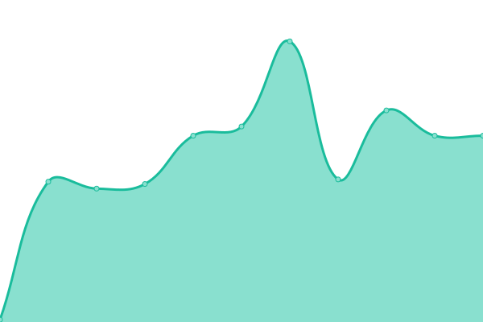

# [📈 Live Status](https://upptime.github.io/upptime): <!--live status--> **🟧 Partial outage**

This repository contains the open-source uptime monitor and status page for [Upptime](https://upptime.js.org), powered by [Upptime](https://github.com/upptime/upptime).

With [Upptime](https://upptime.js.org), you can get your own unlimited and free uptime monitor and status page, powered entirely by a GitHub repository. We use [Issues](https://github.com/upptime/upptime/issues) as incident reports, [Actions](https://github.com/adamcubel/upptime/actions) as uptime monitors, and [Pages](https://upptime.github.io/upptime) for the status page.

<!--start: status pages-->
<!-- This summary is generated by Upptime (https://github.com/upptime/upptime) -->
<!-- Do not edit this manually, your changes will be overwritten -->
<!-- prettier-ignore -->
| URL | Status | History | Response Time | Uptime |
| --- | ------ | ------- | ------------- | ------ |
|  [Google](https://www.google.com) | 🟩 Up | [google.yml](https://github.com/adamcubel/upptime/commits/HEAD/history/google.yml) | 

 60ms
     
 | 

<a href="https://adamcubel.github.io/upptime/history/google">100.00%</a>
    

|  [AWS Artifactory](https://artifact.dev.aws.cce.af.mil/ui) | 🟥 Down | [aws-artifactory.yml](https://github.com/adamcubel/upptime/commits/HEAD/history/aws-artifactory.yml) | 

 0ms
     
 | 

<a href="https://adamcubel.github.io/upptime/history/aws-artifactory">0.74%</a>
    

|  [AWS C1DL Console](https://aws.cdl.af.mil) | 🟥 Down | [aws-c1-dl-console.yml](https://github.com/adamcubel/upptime/commits/HEAD/history/aws-c1-dl-console.yml) | 

 0ms
     
 | 

<a href="https://adamcubel.github.io/upptime/history/aws-c1-dl-console">0.96%</a>
    

|  [Azure Artifactory](https://artifact.dev.azure.cce.af.mil/api) | 🟥 Down | [azure-artifactory.yml](https://github.com/adamcubel/upptime/commits/HEAD/history/azure-artifactory.yml) | 

 0ms
     
 | 

<a href="https://adamcubel.github.io/upptime/history/azure-artifactory">1.13%</a>
    

|  [Azure C1DL Console](https://azure.cdl.af.mil) | 🟥 Down | [azure-c1-dl-console.yml](https://github.com/adamcubel/upptime/commits/HEAD/history/azure-c1-dl-console.yml) | 

 0ms
     
 | 

<a href="https://adamcubel.github.io/upptime/history/azure-c1-dl-console">1.82%</a>
    

<!--end: status pages-->

[**Visit our status website →**](https://upptime.github.io/upptime)

## 📄 License

- Powered by: [Upptime](https://github.com/upptime/upptime)
- Code: [MIT](./LICENSE) © [Upptime](https://upptime.js.org)
- Data in the `./history` directory: [Open Database License](https://opendatacommons.org/licenses/odbl/1-0/)
